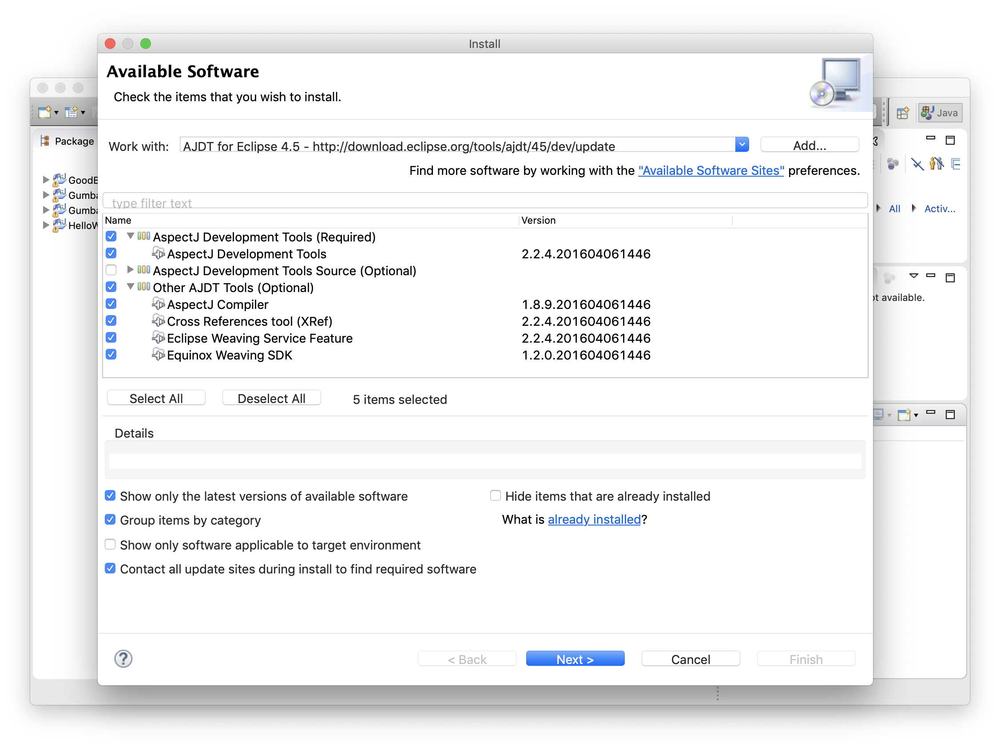
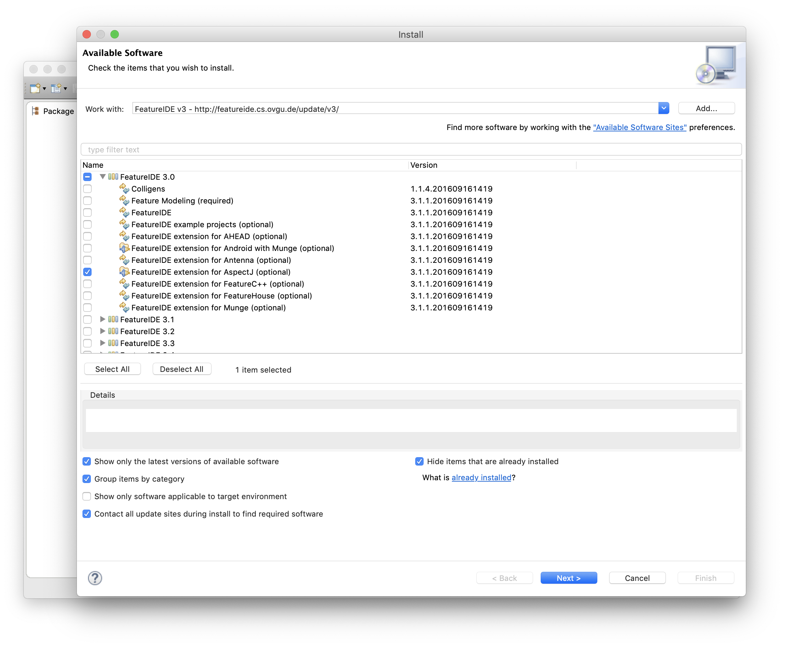

	
	 ______         _                    _____ _____  ______ 
	 |  ____|       | |                  |_   _|  __ \|  ____|
	 | |__ ___  __ _| |_ _   _ _ __ ___    | | | |  | | |__   
	 |  __/ _ \/ _` | __| | | | '__/ _ \   | | | |  | |  __|  
	 | | |  __/ (_| | |_| |_| | | |  __/  _| |_| |__| | |____ 
	 |_|  \___|\__,_|\__|\__,_|_|  \___| |_____|_____/|______|
	                                                                                            
	
* http://www.featureide.com/
* https://featureide.github.io/
* https://github.com/FeatureIDE/FeatureIDE/wiki/Tutorial

# Resources

* Eclipse 4.5.2 + Feature IDE 3.0.0 (Bundle Downloads)

	* https://featureide.github.io/
		

* AspectJ AJDT Tools Installation (Update Site)

	* http://download.eclipse.org/tools/ajdt/45/dev/update

	

* FeatureIDE 3.0.0 based on Eclipse 4.5.2 (Update Site)

	* http://featureide.cs.ovgu.de/update/v3/

	
		
