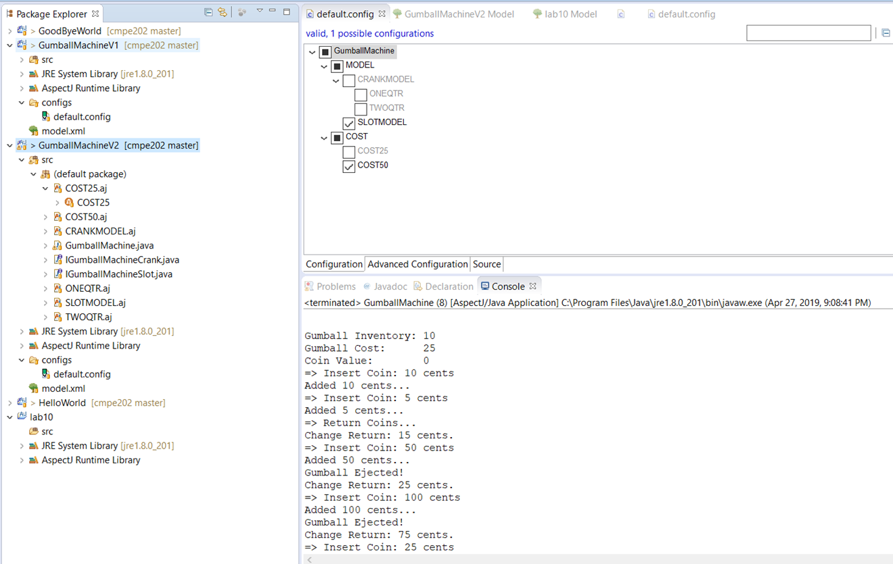

I have imported source code from folder: lab10\features\workspace\
And run the model of GumballMachineV2, but it always returns data of the first machine (one quarter) even I chose the two quarters machine (I use Windows 10).

 

Therefore, I and Marianne had to use Sai’s machine and run all configuration to make sure the application works well.
Below are my screenshots for each configuration:

 

 
1.	Crank Model – one quarter

2.	Crank model – two quarters

 

3.	Slot model – cost 25 cents

 

 

 

4.	Slot model – cost 50 cents

 

In the lab1, I developed 3 kinds of machine:
-	Machine 1: only accepts one quarter.
-	Machine 2: only accepts two quarters.
-	Machine 3: accepts all coins but the cost of each gumball is 50 cents.
But here in this labs, we can select to input one quarter, two quarters, any coins to get 25 cent-gumball or any coins to get 50-cent gumball.
