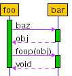
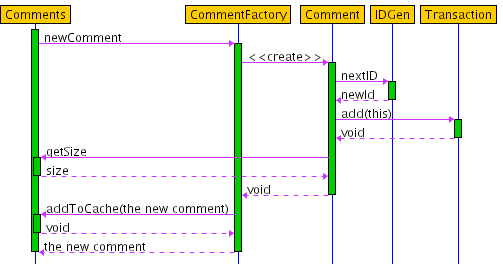

# Sequence 

	Alex Moffat's sequence (Forked)
	https://github.com/greensnark/sequence
	
SEQUENCE is a program for producing UML Sequence Diagrams. In contrast to most similar programs you don't actually draw the diagram. Instead you write a textual description of the method calls you want to diagram and the layout is calculated and drawn automatically.

Although you don't have the exact control over the layout that a drawing program gives you I think this has a couple of advantages. Firstly, it's much quicker to express what you want this way, and that is the point of the diagrams after all. Secondly, I find it easier to achieve a good looking result this way rather than having to manually position each element.

For instance the diagram below is easy to define.



You just have to write this description.

```
foo {
  bar.baz -> obj;
  bar.foop(obj);
}
```

The more complete example show below is provided by the Example option under the Help menu. It demonstrates most of the features of the language used to describe sequence diagrams.



This description is used to produce the diagram.

```
Comments.newComment {
  CommentFactory.newComment -> "the new comment" {
    Comment.<> {
      IDGen.nextID -> newId;
      Transaction.add(this);
      Comments.getSize -> size;
    }
  Comments.addToCache(the new comment);
  }
}
```

## How to Run Sequence

To run SEQUENCE you normally just need to say

	java -jar sequence.jar

However, there are some command line options you can specify. The --headless option is used when you want to generate a .png image from an input file without displaying the SEQUENCE screen. To use it you need to provide the option and follow it with the name of a file containing the text describing the diagram. For example:

	java -jar sequence.jar --headless my_sequence_diagram.txt
	
If you don't supply an the --headless option then the first argument on the command line following sequence.jar is taken as the name of the initial directory to offer in the open dialog. For example:

	java -jar sequence.jar some_dir/another_dir
	
Finally, if you want to be able to use the deprecated, though original, LISP style syntax for authoring sequence diagrams you need to supply the --offer_parser_choice option. For example:

	java -jar sequence.jar --offer_parser_choice
	
You can run SEQUENCE without displaying a screen. In this mode it reads an input file provided on the command line and writes out a file containing an image of the resulting sequence diagram in .png format. You need to supply the --headless command line option and follow it by the name of the file containing the text describing the diagram. The name of the output file is formed by stripping the last extension off the input file name and then appending .png.

	java -jar sequence.jar --headless my_sequence_diagram.txt
	
	
## Syntax


A more formal description of the valid syntax for sequence
diagrams written using the "brace style" syntax.
A sequence diagram consists of the description of a single
method.

	<sequence_diagram> ::= <method_description>

The description of a method is the signature of the method
followed by a semicolon or a method body.

	<method_description> ::= <method_signature> ( ";" | <method_body> )

A method signature is the identifier of the object being called
followed by the method being called on the object and with an optional return value. The identifier of the object being called is separated from the method identifier by a period. The optional return value is preceeded by a ->

	<method_signature> ::= <object_identifier> "." <method_identifier> [ "->" <return_value> ]

The identifier of an object is composed of up to three parts. At least one must be present and they must appear in the order object name, class name, and stereotype.  The class name, if present is preceeded by a colon. The stereotype, if present, is surrounded by < and >.

	<object_identifier> ::= <object_name> [ ":" <class_name> ] [ "<" <stereotype> ">" ] |
                        ":" <class_name> [ "<" <stereotype> ">" ] |
                        "<" <stereotype> ">"

The name of an object is just a string

	<object_name> ::= <string_identifier>

The name of a class is just a string

	<class_name> ::= <string_identifier>

A stereotype is just a string

	<stereotype> ::= <string_identifier>

A string is either a string with no spaces in it, a string surrounded with double quotes or a string surrounded with single quotes. The double quoted string can include an escaped double quote, thus
\", and the single quoted string can include an escaped single
quote, thus \'.

	<string_identifier> ::= 'An unquoted string with no spaces or a string
                         surrounded by double quotes with all enclosed
                         double quotes escaped with \ or a string
                         surrounded by single quotes with all enclosed
                         single quotes escaped with \'

The identifier for a method starts with an optional marker to
indicate repeated calls. This is followed by an optional condition to
express when the method is called.  There must be a method name and
this can be followed by optional method arguments.

	<method_identifier> ::= [ <iteration_marker> ] [ <condition> ] <method_name> [ <method_args> ]

The iteration marker is just a *

	<iteration_marker> ::= "*"

A condition is a string surrounded by [ and ]. It can include a ] if
it is escaped by \.

	<condition> ::= 'A string starting with an open square bracket [ and
                 ending with a close square bracket ] and with any
                 close square brackets inside it escaped with \'

The name of a method is either just a string or it can be a
stereotype surrounded by < and >

	<method_name> ::= <string_identifier> | "<" <stereotype> ">"

The arguments for a method are just a string surrounded by ( and
). It can include a ) if it is escaped with \.

	<method_args> ::= 'A string starting with an open paren ( and ending
                   with a close paren ) and with any close parens
                   inside it escaped with \'

The return value from a method is just a string

	<return_value> ::= <string_identifier>

A method body is zero or more method descriptions surrounded by { and
}

	<method_body> ::= "{" { <method_description> } "}"
